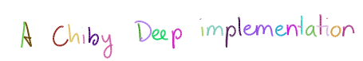
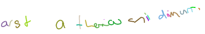
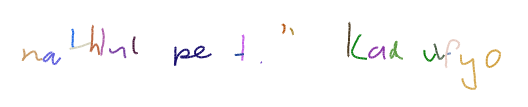
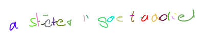
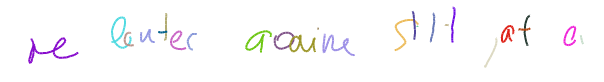

# Handwriting Prediction and Synthesis based on Alex Graves' paper "Generating Sequences With Recurrent Neural Networks"

This project is an implementation of Alex Graves' handwriting generation using LSTM with Mixture Density Network and an Attention Mechanisme using Pytorch. The goal is to code in a straightforward manner. Performance might be sacrificed for better an easier to read code. 
So far, only the handwriting generation is functional (section 4). The synthesis is currently a WIP.
This project uses the strokes and ascii transcriptions of the IAM On-Line Handwriting databse.

## Handwriting Prediction (section 4)
The network consits of 3 layers of 400 LSTMS. 20 gaussian mixtures are used. A first implementation is proposed without skip connections (Handwriting prediction - Model 1). Another with skip connections this time (Handwriting prediction - Model 2). Model 2 seems to give the best results. Likelihood increases faster and gives visually better results.

## Handwriting Synthesis (section 5)
See Handwriting synthesis.ipynb. The network build upon Handwriting prediction - Model 2. It adds an attention mechanism so the network can learn which character it's writing. Ten epochs and a bit of bias give pretty convincing results ! 

